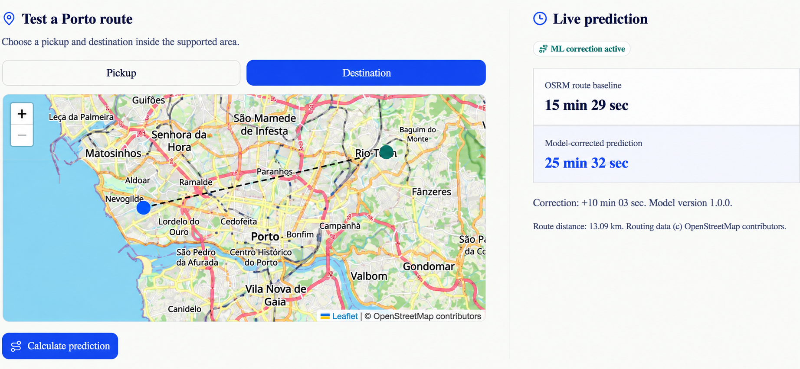
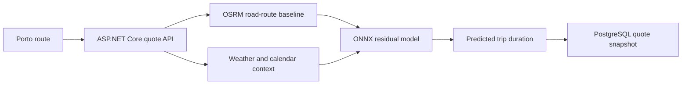

# Cabrynt

Cabrynt is an ML-assisted Porto trip-duration prediction and ride quotation application built with ASP.NET Core. It combines OSRM road routing with an ONNX residual model that adjusts route-duration estimates using quote-time context.

It covers historical trip preparation, model evaluation, ONNX inference in .NET, persisted quote snapshots, and a deployed application.

## Live Deployment

The public application is available at [cabrynt.vercel.app](https://cabrynt.vercel.app).

The frontend runs on Vercel. The ASP.NET Core API runs on Azure Container Apps with PostgreSQL, private OSRM routing, and Azure storage for operational data. GitHub Actions publishes immutable container images and deploys them to Azure through OpenID Connect.



## Highlights

- **OSRM-residual trip-duration model exported to ONNX, parity-tested against scikit-learn, and integrated into ASP.NET Core with explicit fallback behavior.**
- A **38.4% MAE reduction** versus direct OSRM on the locked confirmation cohort: **5.488 min to 3.383 min**.
- A public model demo that shows the OSRM baseline, ML correction, final prediction, and model version for Porto routes.
- Reproducible feature engineering, chronological validation, and model selection for the Porto taxi dataset.

## Architecture

The quote path starts with a Porto route request. The API obtains an OSRM baseline and quote-time context, applies the ONNX correction when it is available, and persists the resulting quote snapshot in PostgreSQL. Minimal API endpoints, services, repositories, DTOs, and validators keep those responsibilities separate.



## Technology Stack

| Area | Technologies |
| --- | --- |
| Backend | .NET 10, ASP.NET Core Minimal APIs, Entity Framework Core, FluentValidation |
| Data | PostgreSQL |
| API | REST, OpenAPI/Swagger |
| Authentication | ASP.NET Core cookie authentication, role-based authorization |
| ML | Python, pandas, scikit-learn, LightGBM experiments, ONNX, ONNX Runtime, OSRM |
| Frontend | Next.js, React, TypeScript |
| Quality and delivery | xUnit, pytest, Docker Compose, GitHub Actions, centralized NuGet package management |

## Trip Duration ML Experiment

[`ml/trip-duration`](ml/trip-duration) is an independently reproducible experiment that predicts taxi travel time from point A to point B in Porto. It combines quote-time calendar and weather features with OSRM route distance and travel-time estimates.

The selected model is a HistGradientBoosting residual model: OSRM provides a road-network duration estimate, and the model predicts a correction. When the model, current weather, an OSRM route, and Porto-scoped coordinates are available, the application calculates `max(OSRM duration + model correction, 0)`. Otherwise, it returns the OSRM estimate or the existing straight-line fallback and identifies the source in the quote response.

The cleaned historical data was split chronologically into 1,049,044 training trips, 224,795 validation trips, and 224,795 test trips. Feature engineering, candidate comparisons, and model selection used the training and validation splits; the final residual parameters were selected with expanding chronological folds inside the route-ready training cohort.

After those decisions were frozen, the deployed residual model was fitted on 199,994 route-ready trips drawn only from the training split. It was evaluated once on a separate, locked 4,999-trip chronological confirmation cohort sampled from the test split. That cohort was not used for feature, parameter, model, or threshold selection:

| Model | MAE | Median absolute error | P90 absolute error |
| --- | ---: | ---: | ---: |
| Direct OSRM | 5.488 min | 3.530 min | 10.817 min |
| Selected OSRM-residual model | 3.383 min | 1.656 min | 6.702 min |

That is a 38.4% MAE reduction and a 38.0% P90 absolute-error reduction versus direct OSRM on the same final cohort. The paired 95% bootstrap interval for model MAE minus OSRM MAE was -2.186 to -2.033 minutes.

The model is not uniformly better for every trip. Direct OSRM was more accurate for completed historical trips lasting up to five minutes (1.183 versus 1.924 MAE minutes). Actual duration is unavailable at quote time, so this finding cannot be translated into a reliable live duration threshold. Cabrynt therefore presents both estimates when ML is active and labels the source used by every quote.

The model has a versioned 23-feature float32 ONNX contract. Its ONNX predictions were verified against the scikit-learn model with a maximum difference of `0.000001752` minutes.

When runtime ML inference is enabled, the passenger quote page shows the estimated trip time separately from the fare calculation and identifies whether it used the ML correction, OSRM routing, or the straight-line fallback. Creating a ride request persists that estimate and, for ML estimates, the configured model version so ride history remains auditable after the quote response expires. OSRM-backed results include OpenStreetMap attribution. The backend accepts quote and ride-request coordinates only inside Cabrynt's Porto service area, matching the route picker and the geographic scope of the model.

Generated data, route caches, and production model binaries are intentionally excluded from Git. The trained ONNX model and its metadata are published as versioned GitHub Release assets rather than committed to source control. See the [ML README](ml/trip-duration/README.md) for methodology, data preparation, benchmarks, and local setup.

<details>
<summary>Local model inference and status</summary>

### Enable Model Inference

The local `.env.example` enables model inference and quote-time weather. After local OSRM is running, the backend downloads the release model once during startup. It verifies the model SHA-256 and the complete 23-feature contract from the companion metadata file before loading ONNX Runtime. A verified model is retained in the configured local cache; if a later release request fails, the cache is used. If neither source is valid, normal quotes continue with OSRM or the straight-line fallback.

To start the complete local quote path, set `Routing__OsrmBaseUrl=http://osrm:5000` in `.env`, then run:

```powershell
docker compose --profile routing up -d --force-recreate backend osrm
```

Successful model-enabled quotes return `estimatedTripDurationSource: "MachineLearning"`. If OSRM, model loading, Porto validation, or weather retrieval is unavailable, the API deliberately identifies the fallback source instead of returning an unlabelled estimate.

The tracked [`.env.example`](.env.example) contains the current release URLs and version. For Docker Compose, the cache is persisted in the named `trip_duration_models` volume. `TripDurationModel__ModelPath` remains available for a local manually supplied ONNX file, primarily for development and tests.

### Model Status

Administrators can open `/admin` to inspect whether the configured trip-duration model is disabled, loading, ready, or unavailable. The page reads the admin-only `GET /api/private/model-status` endpoint and shows the configured model version when inference is enabled. It intentionally does not expose model paths, release URLs, checksums, or raw startup errors.

</details>

## Repository Structure

```text
src/
  backend/                  ASP.NET Core application
  frontend/                 Next.js application
tests/
  backend.UnitTests/        Backend unit tests
  backend.IntegrationTests/ Backend integration tests
ml/
  trip-duration/           Reproducible Porto trip-duration experiment
scripts/                    Local utility scripts
docs/                       Engineering notes
compose.yaml                Local multi-container environment
```

## Run Locally

Prerequisites:

- .NET 10 SDK
- Docker Desktop
- Node.js only for frontend-only development

Create local configuration from the tracked template:

```powershell
Copy-Item .env.example .env
```

Start the full environment:

```powershell
docker compose up --build
```

Local endpoints:

```text
Frontend: http://localhost:3000
Backend:  http://localhost:5113
Swagger:  http://localhost:5113/swagger
Liveness: http://localhost:5113/health/live
Readiness: http://localhost:5113/health/ready
```

`/health/live` confirms that the application process can serve requests. `/health/ready` also verifies PostgreSQL connectivity, which is required to read users and persist ride requests. OSRM, weather, and the ML model remain optional quote dependencies because the application has explicit fallback behavior for them.

`docker compose` reads values from `.env`. For direct `dotnet run`, configure the corresponding database and admin settings through environment variables or .NET user secrets. See [`.env.example`](.env.example) for the required keys.

Docker Compose defaults to the `Development` environment because the local frontend and backend use HTTP. This lets the development cookie policy use the request scheme. A deployed production environment must set `ASPNETCORE_ENVIRONMENT=Production` and terminate HTTPS before enabling secure browser authentication.

## Production Deployment

The frontend is hosted on Vercel and the backend runs on Azure Container Apps alongside private OSRM routing and PostgreSQL. GitHub Actions publishes immutable GHCR images and deploys through Azure OpenID Connect. Production uses persistent storage for database data, protected cookie-authentication keys, the ONNX model cache, and the prepared OSRM graph.

Deployment configuration, release steps, and operational checks are documented in [Production configuration](docs/production-configuration.md) and [Azure infrastructure](infra/README.md).

### Enable Local Road Routing

Cabrynt defaults to a straight-line estimate so normal development and automated tests do not need routing data. To use local OSRM road routing, set the following value in `.env`:

```text
Routing__OsrmBaseUrl=http://osrm:5000
```

Then start the optional routing profile:

```powershell
docker compose --profile routing up -d backend osrm
```

On its first run, Docker downloads the OpenStreetMap Portugal extract into the ignored `osrm_data` volume, then runs OSRM extraction, partitioning, and customization. This can take a while and needs substantial disk space; later starts reuse the prepared volume. The application remains scoped to Porto even though the routing graph contains Portugal.

When `cabrynt-osrm` is healthy, routes are available at `http://localhost:5001` for local inspection and the backend uses the internal Docker address. The configuration uses the official [OSRM backend image](https://github.com/Project-OSRM/osrm-backend) and [Geofabrik Portugal extract](https://download.geofabrik.de/europe/portugal.html).

## Verification

Run backend tests:

```powershell
dotnet test Cabrynt.sln
```

Integration tests need PostgreSQL. Start it locally when it is not already running:

```powershell
docker compose up -d postgres
```

Run ML tests:

```powershell
Set-Location ml/trip-duration
.\.venv\Scripts\python.exe -m pytest tests -q
```

The ML environment and data preparation instructions are documented in the [ML README](ml/trip-duration/README.md).

## Roadmap

- Add OpenID Connect login for a production identity provider.
- Add OpenTelemetry traces and application-level metrics.
- Improve API consistency and integration-test infrastructure.
- Extend administrator workflows only when a concrete operational use case requires them.

## Notes

- Routing and trip-duration ML are optional runtime features. With default local configuration, the quote endpoint keeps the straight-line fallback so development and tests do not require OSRM, weather, or a model file.
- The ML model is scoped to Porto and must not be presented as a general ETA model for arbitrary cities.
- [Engineering notes](docs/project-notes.md) record dependency and quality decisions that are not central to the project overview.
